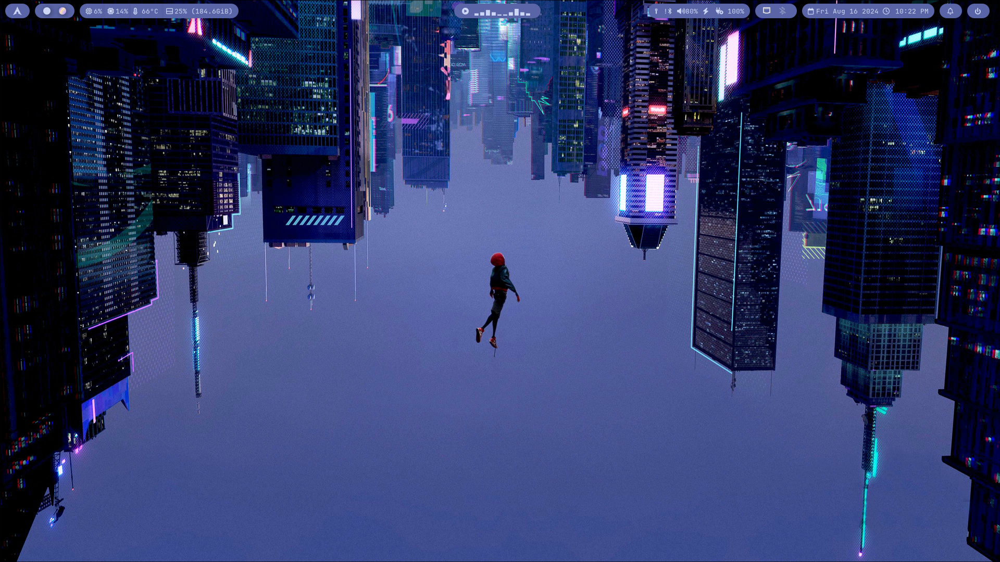
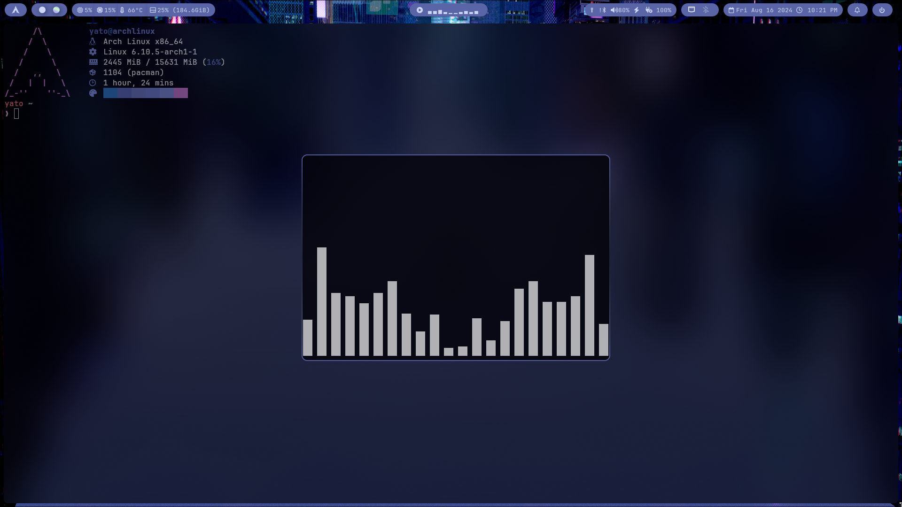
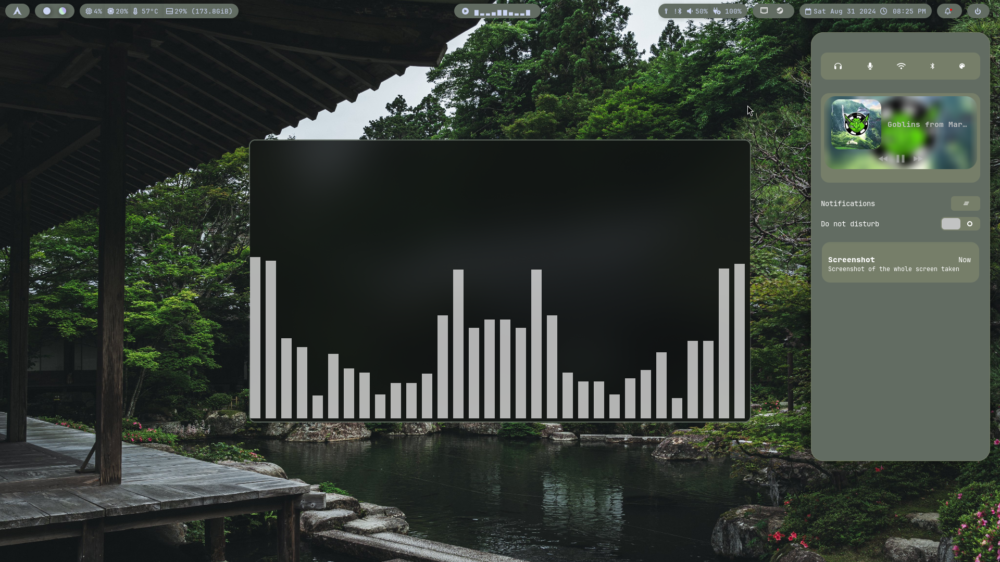

# Table of Contents

- [Introduction](#introduction)
- [Screenshots](#screenshots)
- [Requirements](#requirements)
- [Installation](#installation)
- [Post Installation](#post-installation)
  - [Zsh](#zsh)
  - [Give Permission to scripts](#give-permission-to-scripts)
  - [Enable hypridle](#enable-hypridle)
- [Programs](#programs)
- [Keybindings](#keybindings)
  - [Screenshot Keybinds](#screenshot-keybinds)
  - [General Keybinds](#general-keybinds)
  - [Workspace Navigation](#workspace-navigation)
    - [Move Focus with Arrow Keys](#move-focus-with-arrow-keys)
    - [Switch Workspaces](#switch-workspaces)
    - [Move Active Window to Workspace](#move-active-window-to-workspace)
  - [Special Workspaces](#special-workspaces)
  - [Workspace Scroll](#workspace-scroll)
  - [Window Management](#window-management)
  - [Audio Controls](#audio-controls)
  - [Brightness Controls](#brightness-controls)
  - [Global Keybinds](#global-keybinds)
    - [OBS](#obs)
    - [Discord](#discord)
- [Inspiration and Credits](#inspiration-and-credits)

# Introduction

This repository contains my personal dotfiles for my Arch Linux setup. It features auto color scheme based on selected wallpaper.
The dotfiles are managed using GNU Stow. Feel free to use any part of the configuration that you find useful :)

# Screenshots








# Requirements

Ensure you have the following installed on your system (Not necessary mean u need those, these are for me to copy paste if i ever need to fresh install my system)

```
sudo pacman -S git hyprland kitty dolphin thunar waybar stow nvim hyprpaper zsh fastfetch snapper \
btrfs-assistant pipewire pipewire-alsa alsa-utils pipewire-pulse pavucontrol sof-firmware \
ttf-font-awesome ttf-liberation ttf-cascadia-code-nerd ttf-firacode-nerd ttf-jetbrains-mono-nerd \
gwenview bluez bluez-utils blueman swaync okular qt5ct qt6ct kvantum arc-gtk cliphist \
dunst
```

```
yay -S system76-power pywal-16-colors hyprpicker papirus-folders-git grimblast-git smile
```

# Installation

First, check out the dotfiles repo in your $HOME directory using git

```
git clone https://github.com/SeakMengs/dotfiles.git
cd dotfiles
```

then use GNU stow to create symlinks

```
stow . -t ~
```

to unlink the created symlinks

```
stow -D . -t ~
```

to adopt change from the dotfiles that already exist in your system, use

```
stow . -t ~ --adopt
```

# Post Installation

## Zsh

Change the default shell to zsh

```
chsh -s $(which zsh)
```

## Give Permission to scripts

```
chmod +x ~/.config/scripts/*
```

## Enable hypridle

```
systemctl --user enable --now hypridle.service
```

# Programs

- **Window Manager**: [Hyprland](https://hyprland.org)
- **Terminal**: [Kitty](https://sw.kovidgoyal.net/kitty/)
- **File Manager**: [Dolphin](https://apps.kde.org/dolphin/)
- **Bar**: [Waybar](https://github.com/Alexays/Waybar)
- **Launcher**: [Rofi](https://github.com/davatorium/rofi)
- **Notification Daemon**: [Swaync](https://github.com/ErikReider/SwayNotificationCenter)
- **Lockscreen**: [Hyprlock](https://github.com/hyprwm/hyprlock)
- **Logout Menu**: [Wlogout](https://github.com/ArtsyMacaw/wlogout)
- **Wallpaper Setter**: [Swww](https://github.com/LGFae/swww)
- **Clipboard Manager**: [Cliphist](https://github.com/sentriz/cliphist)

# Keybindings

The main modifier key is set to `SUPER` (Windows key).

## Screenshot Keybinds

| Keybind         | Action                                                                         |
| --------------- | ------------------------------------------------------------------------------ |
| `SUPER+SHIFT+S` | Take a screenshot of a region and save it to `~/Pictures/Screenshots/`         |
| `Print`         | Take a screenshot of the whole screen and save it to `~/Pictures/Screenshots/` |

## General Keybinds

| Keybind       | Action                                             |
| ------------- | -------------------------------------------------- |
| `SUPER+Q`     | Open terminal (`kitty`)                            |
| `SUPER+C`     | Kill active window                                 |
| `SUPER+M`     | Exit Hyprland                                      |
| `SUPER+E`     | Open file manager (`dolphin`)                      |
| `SUPER+V`     | Show clipboard history using `cliphist` and `rofi` |
| `SUPER+T`     | Toggle floating mode for the active window         |
| `SUPER+Space` | Open Rofi application launcher                     |
| `SUPER+F`     | Toggle fullscreen for the active window            |
| `SUPER+P`     | Toggle pseudo mode (e.g., dwindle)                 |
| `SUPER+J`     | Toggle split layout (e.g., dwindle)                |
| `SUPER+W`     | Open rofi menu to select wallpapers                |
| `SUPER+.`     | Open emoji picker (`Smile`)                        |
| `SUPER+F4`    | Open logout menu (`wlogout`)                       |

## Workspace Navigation

### Move Focus with Arrow Keys

| Keybind       | Action                  |
| ------------- | ----------------------- |
| `SUPER+Left`  | Move focus to the left  |
| `SUPER+Right` | Move focus to the right |
| `SUPER+Up`    | Move focus up           |
| `SUPER+Down`  | Move focus down         |

### Switch Workspaces

| Keybind   | Action                 |
| --------- | ---------------------- |
| `SUPER+1` | Switch to workspace 1  |
| `SUPER+2` | Switch to workspace 2  |
| `SUPER+3` | Switch to workspace 3  |
| `SUPER+4` | Switch to workspace 4  |
| `SUPER+5` | Switch to workspace 5  |
| `SUPER+6` | Switch to workspace 6  |
| `SUPER+7` | Switch to workspace 7  |
| `SUPER+8` | Switch to workspace 8  |
| `SUPER+9` | Switch to workspace 9  |
| `SUPER+0` | Switch to workspace 10 |

### Move Active Window to Workspace

| Keybind         | Action                             |
| --------------- | ---------------------------------- |
| `SUPER+SHIFT+1` | Move active window to workspace 1  |
| `SUPER+SHIFT+2` | Move active window to workspace 2  |
| `SUPER+SHIFT+3` | Move active window to workspace 3  |
| `SUPER+SHIFT+4` | Move active window to workspace 4  |
| `SUPER+SHIFT+5` | Move active window to workspace 5  |
| `SUPER+SHIFT+6` | Move active window to workspace 6  |
| `SUPER+SHIFT+7` | Move active window to workspace 7  |
| `SUPER+SHIFT+8` | Move active window to workspace 8  |
| `SUPER+SHIFT+9` | Move active window to workspace 9  |
| `SUPER+SHIFT+0` | Move active window to workspace 10 |

## Special Workspaces

| Keybind         | Action                                                  |
| --------------- | ------------------------------------------------------- |
| `SUPER+A`       | Toggle special workspace (e.g., scratchpad)             |
| `SUPER+SHIFT+A` | Move active window to special workspace (e.g., `magic`) |

## Workspace Scroll

| Keybind            | Action                           |
| ------------------ | -------------------------------- |
| `SUPER+Mouse Down` | Scroll to the next workspace     |
| `SUPER+Mouse Up`   | Scroll to the previous workspace |

## Window Management

| Keybind                    | Action                                  |
| -------------------------- | --------------------------------------- |
| `SUPER+Left Mouse Button`  | Move window                             |
| `SUPER+Right Mouse Button` | Resize window                           |
| `SUPER+SHIFT+Right`        | Resize active window right by 20 pixels |
| `SUPER+SHIFT+Left`         | Resize active window left by 20 pixels  |
| `SUPER+SHIFT+Up`           | Resize active window up by 20 pixels    |
| `SUPER+SHIFT+Down`         | Resize active window down by 20 pixels  |

## Audio Controls

| Keybind                | Action                |
| ---------------------- | --------------------- |
| `XF86AudioRaiseVolume` | Increase volume by 5% |
| `XF86AudioLowerVolume` | Decrease volume by 5% |
| `XF86AudioMute`        | Toggle mute           |
| `XF86AudioPlay`        | Play/Pause media      |
| `XF86AudioPrev`        | Previous media track  |
| `XF86AudioNext`        | Next media track      |

## Brightness Controls

| Keybind                 | Action                    |
| ----------------------- | ------------------------- |
| `XF86MonBrightnessUp`   | Increase brightness by 5% |
| `XF86MonBrightnessDown` | Decrease brightness by 5% |

## Global Keybinds

### OBS

| Keybind | Action                 |
| ------- | ---------------------- |
| `F7`    | Start recording in OBS |
| `F8`    | Stop recording in OBS  |

### Discord

| Keybind    | Action                 |
| ---------- | ---------------------- |
| `SHIFT+F7` | Toggle mute in Discord |

# Inspiration and Credits

- [adi1090x](https://github.com/adi1090x/rofi) for the rofi themes
- [rchrdwllm](https://github.com/rchrdwllm/dotfiles) for inspiration
- [zDyanTB](https://github.com/zDyanTB/HyprNova) for inspiration
- [PROxZIMA](https://github.com/PROxZIMA/caway) for the waybar cava music module
